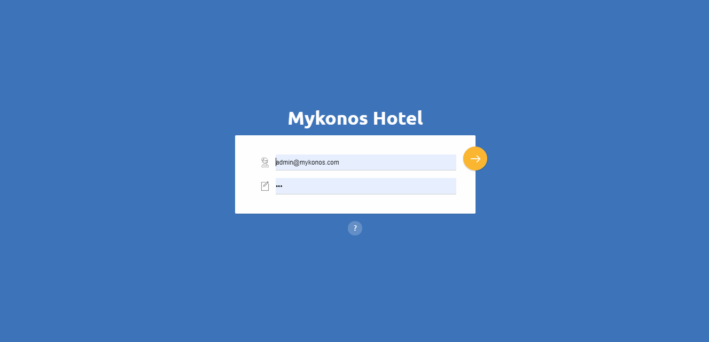
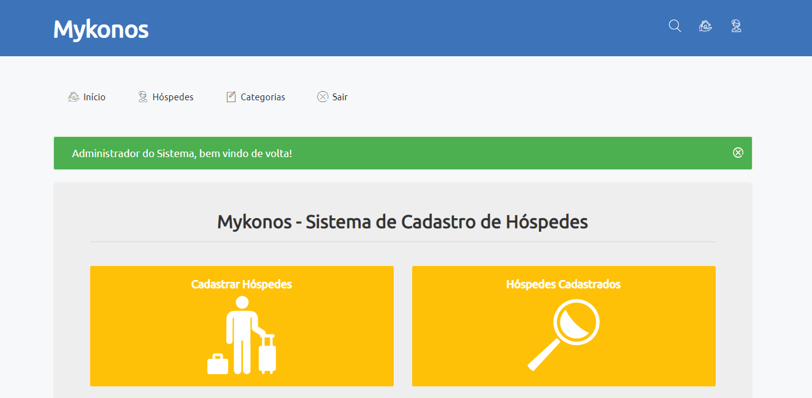
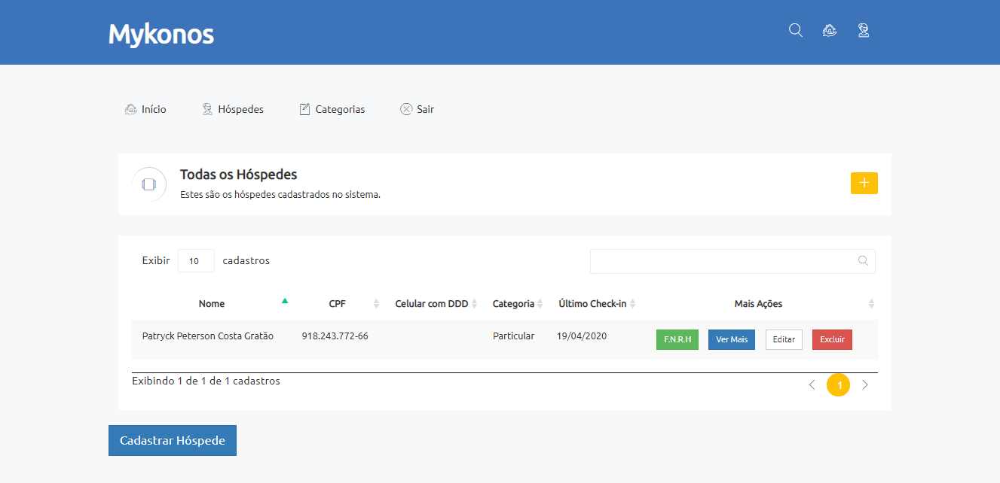
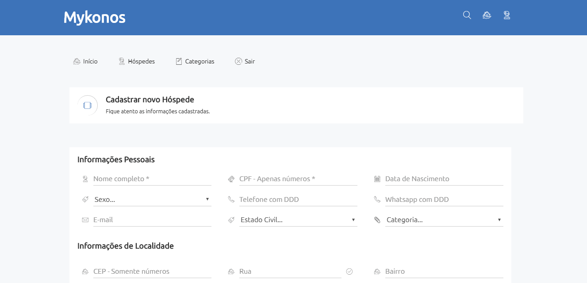
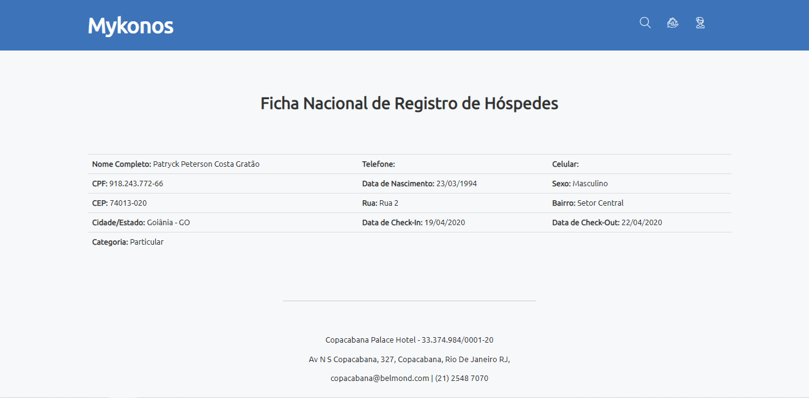
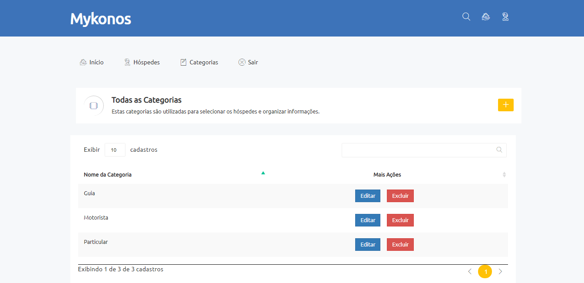
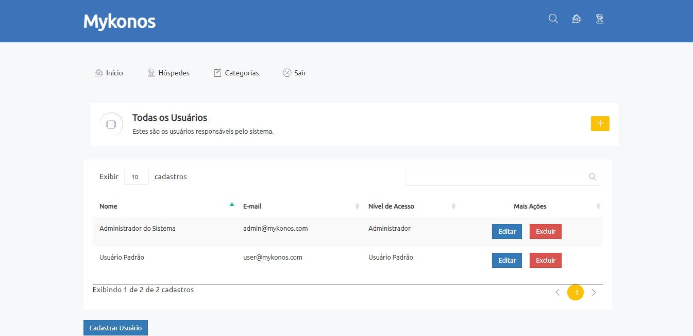
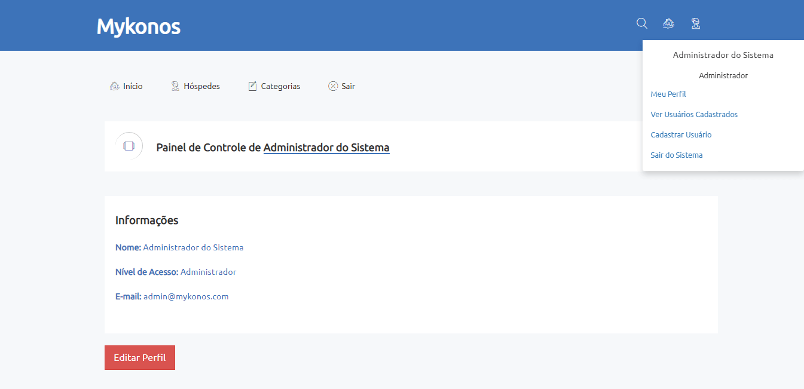
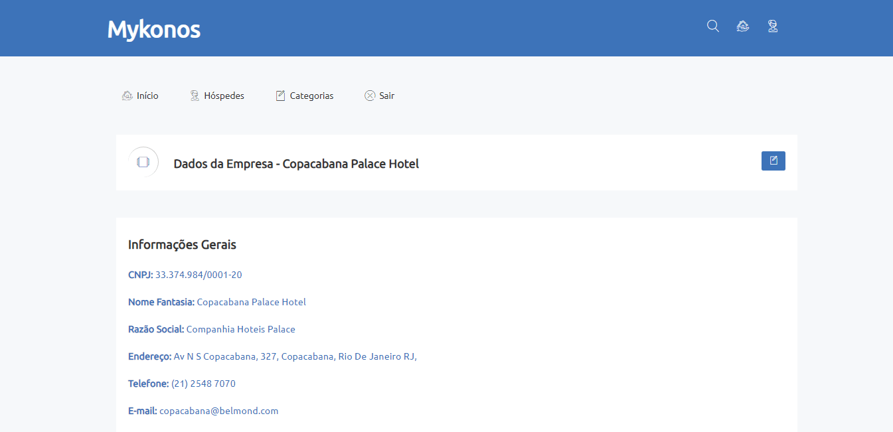
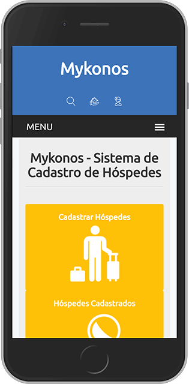

<h1 align="center">
    
</h1>

<h2 align="center">

  🚀 Mykonos - Hotel Management System
</h2>

  <a href="#two_hearts-o-projeto">O Projeto</a>&nbsp;&nbsp;&nbsp;|&nbsp;&nbsp;&nbsp;
  <a href="#computer-layout">Layout</a>&nbsp;&nbsp;&nbsp;|&nbsp;&nbsp;&nbsp;
  <a href="#iphone-demonstração-online">Demonstração Online</a>&nbsp;&nbsp;&nbsp;|&nbsp;&nbsp;&nbsp;
  <a href="#key-como-utilizar">Como Utilizar</a>&nbsp;&nbsp;&nbsp;|&nbsp;&nbsp;&nbsp;
  <a href="#rocket-tecnologias">Tecnologias</a>&nbsp;&nbsp;&nbsp;|&nbsp;&nbsp;&nbsp;
  <a href="#white_check_mark-licença">Licença</a>&nbsp;&nbsp;&nbsp;|&nbsp;&nbsp;&nbsp;

 

## :two_hearts: O Projeto

O **Mykonos** existe para com a missão de propiciar ao gestor hoteleiro o cadastro e conversão de dados dos hóspedes em ações de marketing e pós-venda com intuito de criar uma experiência incrível para seus clientes. 

## :computer: Layout

Tela de Login com validação.

Página inicial quando o usuário já está autenticado.

Listagem de todos os hóspedes cadastrados.

Cadastro de um novo hóspede.

Ficha Nacional de Registro de Hóspedes.

Listagem das categorias de hóspedes.

Possibilidade de cadastrar quantos usuários você quiser com permissões diferentes.

Alterar perfil de usuário

Alterar dados da empresa

 Sistema responsivo e adaptável para celulares e tablets.

## :iphone: Demonstração Online

Acesse o sistema Mykonos e veja como ele funciona:

Acesse: https://pgratao.com.br/mykonos

    Administrador do Sistema
    
    login: admin@mykonos.com
    senha: 123

    Usuário Comum
    
    login: user@mykonos.com
    senha: 123

## :key: Como Utilizar

Você pode utilizar o mykonos em seu hotel basta seguir os passos abaixo.

### **Requisitos**:
- [x] Ter um servidor ou hospedagem com PHP, Apache, phpmyadmin e MySql instalado;
- [x] Preparar o seu servidor ou hospedagem para o mykonos:
  - [x] Criar um banco de dados;
  - [x] Criar um usuário com senha para administrar o banco de dados;
  - [x] Criar uma pasta ou subdomínio para armazenar o mykonos;

### **Passo a Passo**:

#### Parte 1 - Instalação dos arquivos 

1. Fazer o download do sistema &#8594;  [Mykonos.zip](https://github.com/patryckgratao/mykonos-hotel-management/archive/master.zip)
2. Acessar a pasta ou subdomínio destinada ao Mykonos e **carregar o arquivo baixado no passo 1** para o servidor
3. Após fazer o upload do arquivo para o servidor você deve **extraí-lo**.
4. Será criada uma pasta chamada **mykonos-hotel-management-master** você deve renomear para **mykonos**

#### Parte 2 - Configuração do Banco de dados

1. Acesse o arquivo `mykonos/models/conecta.php` e clique em editar.
2. Coloque os dados referentes ao banco de dados, usuário, senha que você criou e salve as alterações.
3. Acesse o arquivo `banco.sql` e copie o código &#8594; [Banco.sql](https://raw.githubusercontent.com/patryckgratao/mykonos-hotel-management/master/models/banco.sql)
3. Acesse o **phpmyadmin**;
4. Selecione o banco de dados que você criou;
5. Vá até a aba **SQL** cole o código copiado no passo 3 e clique em Executar;
6. Pronto, feche o phpmyadmin e vamos para o primeiro acesso.

#### Parte 3 - Primeiro acesso

1. Acesse o endereço onde você colocou o sistema, algo parecido com isso &#8594; `http://seudominio.com/mykonos`

Foram criados dois usuários com níveis de permissão diferentes:

    Administrador do Sistema
    
    login: admin@mykonos.com
    senha: 123

    Usuário Comum
    
    login: user@mykonos.com
    senha: 123

Prontinho, você está dentro do sistema que gerenciará seu hotel.

## :rocket: Tecnologias

O Mykonos foi desenvolvido com as seguintes tecnologias:

- Backend → PHP
- Frontend → HTML, CSS, JS e [Tema Notika](https://github.com/puikinsh/notika)

## :white_check_mark: Licença

Distribuído sob a licença MIT, livre para uso e edição.

---

Feito com ❤️ por **Patryck Gratão**